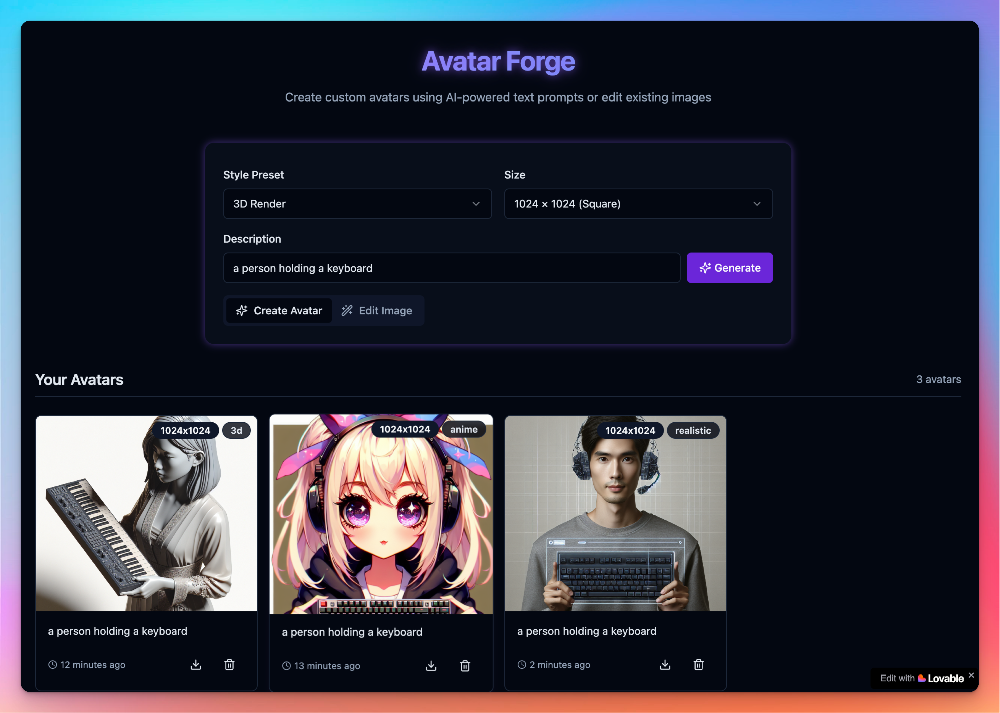

# Avatar Forge

A modern web application for creating and editing AI-generated avatars using OpenAI's DALL-E API. Built with React, TypeScript, and Supabase. GEnerated ysing Lovable.



## Features

- 🎨 Create AI-generated avatars from text prompts
- ✏️ Edit existing images with AI-powered transformations
- 🎭 Multiple style presets (Realistic, Anime, Pixel Art, 3D, Sketch)
- 📱 Responsive design with modern UI components
- 💾 Local storage for saving generated avatars
- ⚡ Fast and efficient image processing
- 🔒 Secure API key management through Supabase Edge Functions

## Tech Stack

- **Frontend:**
  - React 18
  - TypeScript
  - Vite
  - Tailwind CSS
  - shadcn/ui components
  - React Query
  - React Router

- **Backend:**
  - Supabase Edge Functions
  - OpenAI DALL-E API
  - Local Storage for persistence

## Getting Started

### Prerequisites

- Node.js 18+ and npm
- Supabase account
- OpenAI API key

### Installation

1. Clone the repository:
```bash
git clone https://github.com/yourusername/avatar-forge.git
cd avatar-forge
```

2. Install dependencies:
```bash
npm install
```

3. Set up environment variables:
Create a `.env` file in the root directory with the following variables:
```env
VITE_SUPABASE_URL=your_supabase_url
VITE_SUPABASE_ANON_KEY=your_supabase_anon_key
```

4. Start the development server:
```bash
npm run dev
```

## Project Structure

```
src/
├── components/     # Reusable UI components
├── services/      # API and business logic
├── utils/         # Helper functions
├── hooks/         # Custom React hooks
├── integrations/  # Third-party service integrations
└── pages/         # Page components
```

## Key Features Implementation

### Avatar Generation
- Uses OpenAI's DALL-E API through Supabase Edge Functions
- Supports multiple image sizes (1024x1024, 1024x1792, 1792x1024)
- Implements style presets for different artistic directions
- Handles both creation and editing modes

### Image Processing
- Base64 image handling
- File validation and optimization
- Secure API key management
- Error handling and fallback mechanisms

### State Management
- React Query for API state
- Local storage for persistence
- Context-based theme management
- Form state handling with React Hook Form

## Best Practices

- TypeScript for type safety
- Component-based architecture
- Responsive design principles
- Error boundary implementation
- Performance optimization
- Accessibility compliance

## Contributing

1. Fork the repository
2. Create your feature branch (`git checkout -b feature/amazing-feature`)
3. Commit your changes (`git commit -m 'Add some amazing feature'`)
4. Push to the branch (`git push origin feature/amazing-feature`)
5. Open a Pull Request

## License

This project is licensed under the MIT License - see the [LICENSE](LICENSE) file for details.

## Acknowledgments

- OpenAI for the DALL-E API
- Supabase for the backend infrastructure
- shadcn/ui for the component library
- The open-source community for various tools and libraries

## Support

For support, email support@example.com or join our Slack channel.
